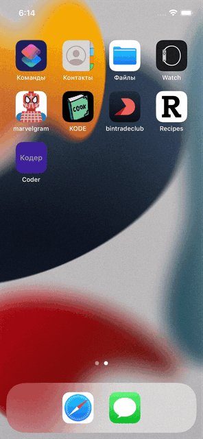
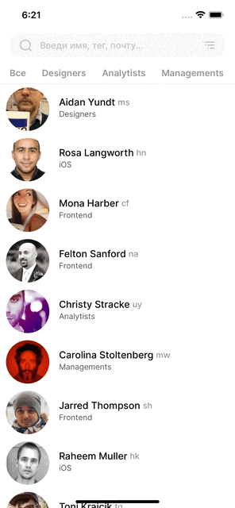
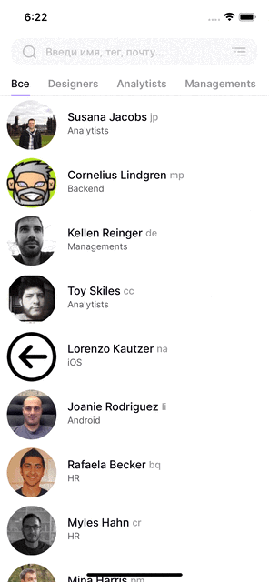
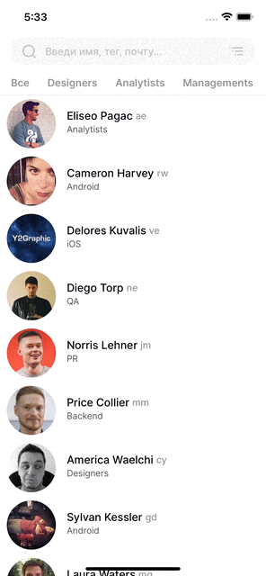
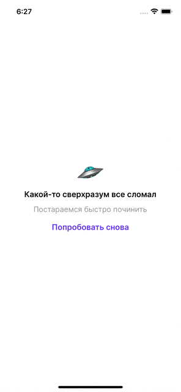
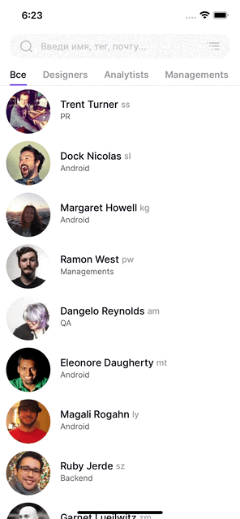
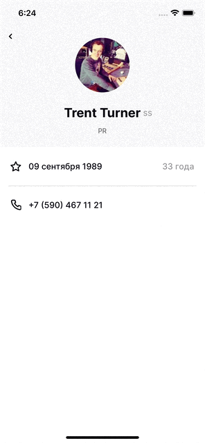

<h1 align="center">Coder</h1> 
<h1 align="center">Test task taken from <a href="https://kode.ru/">KODE</a> from the public <a href="https://github.com/appKODE/trainee-test-ios">gitHub</a> repository.</h1> 

## Contents

1. [Technical Requirements](#technical-requirements)
2. [Overview](#overview)
3. [Description of features](#description-of-features)
4. [FAQ](#faq)

## Technical Requirements

* iOS 13+
* Swift 5
* UIKit(programmatically UI)
* MVC
* <a href="https://www.figma.com/file/GRRKONipVClULsfdCAuVs1/KODE-Trainee-Dev-Осень'21?node-id=0%3A1">Design</a>
* <a href="https://kode-education.stoplight.io/docs/trainee-test/b3A6MjUxNDM5Mjg-get-users">API</a>

## Overview

<table>
    <thead>
        <tr>
            <th>Launch</th>
            <th>Search</th>
            <th>Sorting</th>
        </tr>
    </thead>
    <tbody>
        <tr>
            <td>
                
            </td>
            <td>
                
            </td>
                        <td>
                
            </td>
        </tr>
    </tbody>
</table>

<table>
    <thead>
        <tr>
            <th>Tabs</th>
            <th>Pull to Refresh</th>
            <th>NetworkError</th>
        </tr>
    </thead>
    <tbody>
        <tr>
            <td>
                
            </td>
            <td>
                
            </td>
                        <td>
                
            </td>
        </tr>
    </tbody>
</table>

<table>
    <thead>
        <tr>
            <th>Internal Error</th>
            <th>Profile</th>
            <th>Call</th>
        </tr>
    </thead>
    <tbody>
        <tr>
            <td>
                
            </td>
            <td>
                
            </td>
            <td>
                
            </td>
        </tr>
    </tbody>
</table>

<table>
    <thead>
        </tr>
    </tbody>
</table>

## Description of features

To get acquainted with the feature device, you can look in the [history](https://github.com/NikitaRekaev/Coder/pulls?q=is%3Apr+is%3Aclosed) Pull Requests.

1. Launch:
    * Custom launchScreen
    * UI-skeleton while loading data from server
2. Search
    * Search by first name
    * Search by last name
    * Search by tag
    * Search error (not found)
3. Sorting
    * Sorted by alphabet
    * Sorted by birth day
4. Localization
    * Localization of the Russian language
    * Localization of the English language
5. Error
    * Internet connection error handling
    * Handling internal errors from the server
6. Details
    * Call by clicking on a number
    * Closing the screen by pop-swipe
7. Pull to refresh
        * Custom pull to refresh
     * If you drag the table, users will be updated
8. Figma like design
    * Declension of age
    * Custom back button
    * First 3 letters of the month
    * Input field by layout: filter button and magnifying glass button change color according to the state of the field
        * Custom BottomSheet for 13 iOS, no third party frameworks. 
    * Offer to call

## FAQ

Q: Why did not use third-party framework? 
A: I wanted to implement all the functionality completely natively, you can see my work with third-party frameworks in this [project](https://github.com/NikitaRekaev/Recipes). 

Q: Why i chose [MVС](https://ru.wikipedia.org/wiki/Model-View-Controller) architecture?  
A: Because it's perfect for this small project. 

Q: Why don’t used [SwiftLint](https://github.com/realm/SwiftLint)? 
A: Because I wanted to keep a completely native implementation and get rid of dependencies. 
